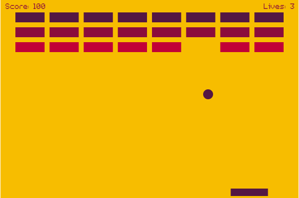
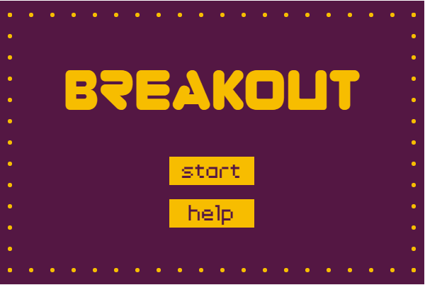
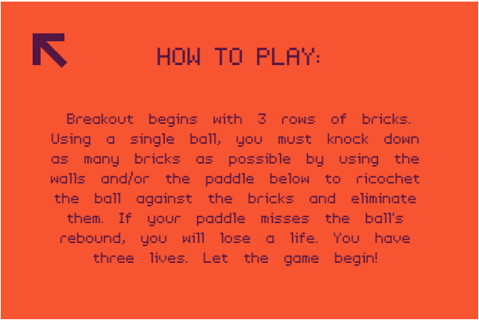
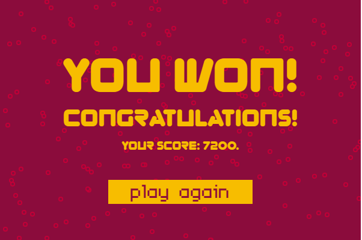
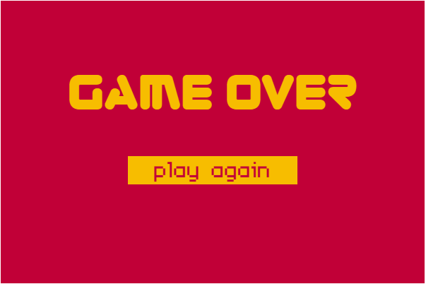

This is a simple Breakout game written entirely in pure JavaScript and rendered on HTML5 <canvas>.

Breakout is a game where you control a paddle at the bottom of the screen, and you use it to hit a ball upwards to break bricks. The goal is to break all the bricks, and not let the ball through the ground too many times.

Feature list, broken down by scene:
* Playing scene

  - User-controlled paddle (keyboard and mouse controls)
  - Multiple colored bricks
  - Ball movement
  - Collision detection
  - Life display
  - Score display
* Main Scene

  - Headline
  - Start button
  - Help button
  - Decorations
* Help Scene

  - Headline
  - Text
  - Back button
* Win Scene

  - Headlines
  - Final score display
  - Restart button
  - Decorations
* Game over Scene

  - Headline
  - Restart button

Technologies used:
* HTML
* CSS
* JS
* Canvas API

Room for improvement:
* make the game display properly on small screens (responsive web design) and add touch events
* add levels to the game
* add ability to pause and resume game
* add ability to start game on enter press
* add brick explosion effects
* add sound effects
